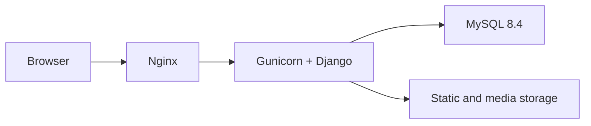

# TernNest

> Find your next nest.

[](https://www.python.org/)
[](https://www.djangoproject.com/)
[](https://www.django-rest-framework.org/)
[](https://www.mysql.com/)
[](https://www.docker.com/)

TernNest is a full-stack short-term rental platform built with Django and Django REST Framework. Users can discover properties, manage favorites, create bookings, and leave reviews after completed stays. The same account can also become a landlord, publish listings, manage availability, and process booking requests.

The project includes a REST API, a Django template-based frontend, JWT authentication, role-based permissions, MySQL, demo data generation, automated tests, and a Docker deployment stack with Gunicorn and Nginx.

## Contents

- [Features](#features)
- [Architecture](#architecture)
- [Technology stack](#technology-stack)
- [Project structure](#project-structure)
- [Getting started with Docker](#getting-started-with-docker)
- [Local development without Docker](#local-development-without-docker)
- [Environment variables](#environment-variables)
- [Demo data and accounts](#demo-data-and-accounts)
- [Roles and permissions](#roles-and-permissions)
- [API overview](#api-overview)
- [Search and ordering](#search-and-ordering)
- [Business rules](#business-rules)
- [Testing](#testing)
- [Deployment notes](#deployment-notes)

## Features

### Accounts and authentication

- Custom user model with email-based login
- Registration, login, profile editing, avatar upload, and password change
- JWT access and refresh tokens
- Tenant and Landlord groups with server-side permissions
- Role-mode switch without signing in again
- One account can have both roles

### Listings

- Create, read, update, publish, deactivate, and delete listings
- Apartment, house, and studio property types
- One to four listing images with a designated main image
- Up to 20 amenities per listing
- Owner-only listing and image management
- Protected historical data: listings linked to bookings cannot be deleted accidentally and can be deactivated instead

### Search and discovery

- Keyword search in listing titles and descriptions
- Filters for city, country, property type, price, bedrooms, beds, bathrooms, guest capacity, amenities, and available dates
- Ordering by creation date, price, rating, or popularity
- Popular search queries
- Per-user and per-session listing view tracking
- Authenticated tenant view history
- One counted view per viewer, listing, and day; owner views are ignored

### Booking and availability

- Booking requests with server-calculated nights and total price
- Availability validation against active bookings and owner-blocked periods
- Owner calendar blocks for maintenance, renovation, vacation, or personal stays
- Configurable check-in and check-out times
- Three-hour minimum cleaning gap between stays
- Booking lifecycle: `pending`, `confirmed`, `rejected`, `cancelled`, and `completed`
- Separate owner actions to confirm, reject, cancel, and complete bookings
- Guest cancellation deadline of 24 hours before check-in

### Reviews and favorites

- One review per completed booking
- Ratings from 1 to 5 plus separate liked and disliked text
- Up to three review images
- Review editing and deletion by the author
- Personal favorites list
- Aggregated listing rating, review count, and view count

## Architecture



The frontend is rendered with Django templates and uses JavaScript to communicate with the versioned REST API. In Docker, Nginx serves static and media files and proxies application requests to Gunicorn.

## Technology stack

| Area | Technology |
| --- | --- |
| Backend | Python 3.14, Django 6.1.1 |
| API | Django REST Framework 3.18.1 |
| Authentication | Simple JWT 5.5.1 |
| Database | MySQL 8.4; SQLite is available for local development |
| Frontend | Django templates, HTML, CSS, JavaScript |
| Image handling | Pillow 12.3.0 |
| Demo data | Faker 40.39.0 |
| Application server | Gunicorn 26.2.0 |
| Reverse proxy | Nginx |
| Deployment | Docker Compose, AWS EC2 |

## Project structure

```text
Final_Project_Django_TernNest/
├── apps/
│   ├── accounts/       # Users, JWT endpoints, roles, and profile settings
│   ├── ai_assistant/   # Optional assistant scaffold, disabled by default
│   ├── bookings/       # Bookings, status actions, and blocked periods
│   ├── core/           # Shared models and demo-data command
│   ├── frontend/       # Pages, templates, CSS, and browser-side JavaScript
│   ├── listings/       # Listings, images, amenities, favorites, and search data
│   └── reviews/        # Reviews and review images
├── config/             # Django settings, root URLs, WSGI, and ASGI
├── docker/nginx/       # Nginx configuration
├── seed_data/listings/ # Demo listing images
├── media/              # Uploaded media files
├── static/             # Source static files
├── Dockerfile
├── docker-compose.yml
├── env_example
├── manage.py
└── requirements.txt
```

## Getting started with Docker

Docker is the recommended way to run the complete stack with MySQL, Gunicorn, and Nginx.

### Prerequisites

- Git
- Docker Engine or Docker Desktop
- Docker Compose v2 (`docker compose`)

### 1. Clone the repository

```bash
git clone https://github.com/Mikt1an/Final_Project_Django_TernNest.git
cd Final_Project_Django_TernNest
```

### 2. Create the environment file

On Linux, macOS, or Git Bash:

```bash
cp env_example .env
```

On Windows PowerShell:

```powershell
Copy-Item env_example .env
```

At minimum, replace the secret and database passwords in `.env`:

```dotenv
SECRET_KEY=replace-with-a-long-random-value
DEBUG=True
ALLOWED_HOSTS=127.0.0.1,localhost

MYSQL_DATABASE=ternnest
MYSQL_USER=ternnest_app
MYSQL_PASSWORD=replace-with-a-strong-password
MYSQL_ROOT_PASSWORD=replace-with-another-strong-password

DJANGO_TIME_ZONE=Europe/Berlin
DJANGO_LANGUAGE_CODE=en-us
```

A random secret can be generated with:

```bash
python -c "import secrets; print(secrets.token_urlsafe(50))"
```

### 3. Build and start the services

```bash
docker compose up -d --build
```

Check that `db`, `web`, and `nginx` are running:

```bash
docker compose ps
```

### 4. Prepare the database

```bash
docker compose exec web python manage.py migrate
docker compose exec web python manage.py seed_demo
docker compose exec web python manage.py setup_groups
```

`seed_demo` is optional. When it is used, run `setup_groups` after it so the generated property owners receive the Landlord role.

To create an administrator:

```bash
docker compose exec web python manage.py createsuperuser
```

### 5. Open the application

- Website: <http://127.0.0.1:8000/>
- Django admin: <http://127.0.0.1:8000/admin/>
- API base: <http://127.0.0.1:8000/api/v1/>

Useful commands:

```bash
docker compose logs -f web nginx db
docker compose restart
docker compose down
```

`docker compose down` keeps the named MySQL volume. Do not add `-v` unless you intentionally want to delete the database volume.

## Local development without Docker

SQLite can be used for a lightweight development setup.

### 1. Create and activate a virtual environment

```bash
python -m venv .venv
```

Linux or macOS:

```bash
source .venv/bin/activate
```

Windows Git Bash:

```bash
source .venv/Scripts/activate
```

Windows PowerShell:

```powershell
.venv\Scripts\Activate.ps1
```

### 2. Install dependencies

```bash
python -m pip install --upgrade pip
python -m pip install -r requirements.txt
```

### 3. Configure and start Django

Copy `env_example` to `.env`, set a valid `SECRET_KEY`, and use:

```dotenv
DEBUG=True
ALLOWED_HOSTS=127.0.0.1,localhost
MYSQL=False
```

Then run:

```bash
python manage.py migrate
python manage.py seed_demo
python manage.py setup_groups
python manage.py runserver
```

Open <http://127.0.0.1:8000/>.

## Environment variables

| Variable | Purpose | Typical local value |
| --- | --- | --- |
| `SECRET_KEY` | Django cryptographic secret | Required; generate a unique value |
| `DEBUG` | Enables development error pages | `True` locally, `False` in production |
| `ALLOWED_HOSTS` | Comma-separated accepted hosts | `127.0.0.1,localhost` |
| `API_PREFIX` | REST API URL prefix | `api` |
| `API_VERSION` | REST API version | `v1` |
| `MYSQL` | Selects MySQL instead of SQLite outside Compose | `False` locally |
| `MYSQL_DATABASE` | MySQL database name | `ternnest` |
| `MYSQL_USER` | MySQL application user | `ternnest_app` |
| `MYSQL_PASSWORD` | MySQL application password | Required for Docker/MySQL |
| `MYSQL_ROOT_PASSWORD` | MySQL root password | Required for Docker/MySQL |
| `MYSQL_HOST` | MySQL hostname | `127.0.0.1`; Compose supplies `db` |
| `MYSQL_PORT` | MySQL port | `3306` |
| `DJANGO_TIME_ZONE` | Application timezone | `Europe/Berlin` or `UTC` |
| `DJANGO_LANGUAGE_CODE` | Django language code | `en-us` |
| `NGINX_BIND_ADDRESS` | Address exposed by the Nginx container | `127.0.0.1` locally |
| `NGINX_PORT` | Host port exposed by Nginx | `8000` locally |
| `AI_AGENT_ENABLED` | Enables the optional AI scaffold | `False` |

Never commit `.env`, passwords, API keys, or production secrets.

## Demo data and accounts

The idempotent `seed_demo` command creates:

- 5 demo owners
- 12 demo guests
- 19 furnished listings with images and amenities
- completed, confirmed, pending, and cancelled bookings
- reviews and ratings for completed stays

Run it with:

```bash
python manage.py seed_demo
python manage.py setup_groups
```

Demo credentials:

| Account | Email | Password |
| --- | --- | --- |
| Property owner | `owner1@ternnest.test` | `DemoPass123!` |
| Guest | `guest1@ternnest.test` | `DemoPass123!` |

These credentials are for development and presentations only.

## Roles and permissions

TernNest uses Django Groups instead of separate user models:

- Every newly registered user receives the Tenant role.
- A tenant can add the Landlord role through the interface or `POST /api/v1/accounts/become-landlord/`.
- Becoming a landlord does not remove the Tenant role.
- The interface can switch between tenant and landlord modes without another login.
- API permissions remain authoritative regardless of which interface mode is selected.

The `setup_groups` management command is safe to run repeatedly. It creates or updates both groups, assigns their Django permissions, adds all regular users to Tenant, and adds existing listing owners to Landlord.

Examples of enforced permissions:

- Only landlords can create listings.
- Only a listing owner can update its details, images, or blocked periods.
- Only tenants can manage their favorites and create booking requests.
- Only booking participants can view a booking.
- Only staff users can create, update, or delete amenities.
- Only the guest from a completed stay can create its review.

## API overview

The default API root is `/api/v1/`. Protected endpoints expect:

```http
Authorization: Bearer <access-token>
```

### Accounts

| Method | Endpoint | Purpose |
| --- | --- | --- |
| `POST` | `/api/v1/accounts/register/` | Register a user |
| `POST` | `/api/v1/accounts/login/` | Obtain access and refresh tokens |
| `POST` | `/api/v1/accounts/token/refresh/` | Refresh an access token |
| `GET`, `PATCH` | `/api/v1/accounts/me/` | Read or update the current profile |
| `POST` | `/api/v1/accounts/change-password/` | Change the current password |
| `POST` | `/api/v1/accounts/become-landlord/` | Add the Landlord role |

### Listings and discovery

| Method | Endpoint | Purpose |
| --- | --- | --- |
| `GET`, `POST` | `/api/v1/listings/` | Search listings or create one |
| `GET`, `PUT`, `PATCH`, `DELETE` | `/api/v1/listings/<id>/` | Listing detail and owner operations |
| `GET`, `POST` | `/api/v1/listings/<id>/images/` | List or upload listing images |
| `GET`, `PUT`, `PATCH`, `DELETE` | `/api/v1/listings/<id>/images/<image_id>/` | Manage one listing image |
| `GET`, `POST` | `/api/v1/listings/amenities/` | List amenities; staff can create |
| `GET`, `POST` | `/api/v1/listings/favorites/` | List or create personal favorites |
| `DELETE` | `/api/v1/listings/favorites/<id>/` | Remove a personal favorite |
| `GET` | `/api/v1/listings/view-history/` | Current tenant's listing history |
| `GET` | `/api/v1/listings/popular-searches/` | Five most popular search queries |

### Bookings and reviews

| Method | Endpoint | Purpose |
| --- | --- | --- |
| `GET`, `POST` | `/api/v1/bookings/` | List participant bookings or create a request |
| `GET` | `/api/v1/bookings/<id>/` | Retrieve a participant booking |
| `POST` | `/api/v1/bookings/<id>/confirm/` | Owner confirms a pending booking |
| `POST` | `/api/v1/bookings/<id>/reject/` | Owner rejects a pending booking |
| `POST` | `/api/v1/bookings/<id>/cancel/` | Guest or owner cancels when permitted |
| `POST` | `/api/v1/bookings/<id>/complete/` | Owner completes a finished stay |
| `GET`, `POST` | `/api/v1/bookings/blocked-periods/` | List or create owner calendar blocks |
| `GET`, `PUT`, `PATCH`, `DELETE` | `/api/v1/bookings/blocked-periods/<id>/` | Manage one calendar block |
| `GET`, `POST` | `/api/v1/reviews/` | List reviews or create one |
| `GET`, `PUT`, `PATCH`, `DELETE` | `/api/v1/reviews/<id>/` | Read or manage one review |
| `POST` | `/api/v1/reviews/images/` | Upload a review image |
| `GET`, `DELETE` | `/api/v1/reviews/images/<id>/` | Read or delete a review image |

## Search and ordering

Example:

```http
GET /api/v1/listings/?city=Munich&guests=2&min_price=80&max_price=180&check_in=2026-10-10&check_out=2026-10-14&ordering=-rating
```

Supported listing query parameters:

| Parameter | Description |
| --- | --- |
| `search` | Case-insensitive title and description search |
| `city`, `country` | Case-insensitive location filters |
| `listing_type` | `apartment`, `house`, or `studio` |
| `min_price`, `max_price` | Price-per-night range |
| `bedrooms`, `beds`, `bathrooms` | Exact room and bed values |
| `guests` | Minimum required guest capacity |
| `amenities` | Comma-separated amenity IDs; all selected amenities are required |
| `check_in`, `check_out` | Available date range in `YYYY-MM-DD` format |
| `ordering` | Result ordering |

Ordering values:

- `-created_at` — newest first
- `created_at` — oldest first
- `price_per_night` — lowest price first
- `-price_per_night` — highest price first
- `-rating` — highest rating first
- `rating` — lowest rating first
- `popular` — views, review count, rating, and recency

## Business rules

- A user cannot book their own listing.
- Guest count cannot exceed the listing capacity.
- Booking dates cannot overlap active bookings or blocked periods.
- Check-in and check-out must respect the listing's configured times.
- Same-day turnover is allowed only when the three-hour cleaning gap is satisfied.
- Nights and total price are calculated by the server.
- A studio always has zero bedrooms.
- A guest can cancel a pending or confirmed booking at least 24 hours before check-in.
- A landlord rejects pending requests and can cancel only confirmed bookings before check-in.
- A confirmed booking can be completed only after check-out.
- A review requires a completed booking whose check-out is in the past.
- Each booking can have at most one review.

## Testing

Run the complete Django test suite:

```bash
python manage.py test
```

Additional project checks:

```bash
python manage.py check
python manage.py makemigrations --check --dry-run
python manage.py migrate --plan
```

The test suite covers accounts, permissions, listing CRUD, images, favorites, search, filters, ordering, view and search history, booking conflicts and status transitions, blocked periods, reviews, and review images.

## Deployment notes

The repository contains a production-style Docker stack:

- `db`: MySQL 8.4 with a persistent named volume
- `web`: Django served by Gunicorn with two workers
- `nginx`: reverse proxy plus static and media serving
- All services use `restart: unless-stopped`

For an EC2 deployment, use production values similar to:

```dotenv
DEBUG=False
ALLOWED_HOSTS=your-public-ip,your-domain.example
NGINX_BIND_ADDRESS=0.0.0.0
NGINX_PORT=80
DJANGO_TIME_ZONE=Europe/Berlin
```

After cloning the repository and creating `.env` on the server:

```bash
docker compose up -d --build
docker compose exec web python manage.py migrate
docker compose exec web python manage.py setup_groups
docker compose ps
```

If demo content is required on a fresh server, run `seed_demo` before `setup_groups`.

Recommended production checks:

- Restrict SSH in the EC2 Security Group to a trusted IP address.
- Expose only the required HTTP/HTTPS ports.
- Keep `DEBUG=False` and use unique production secrets.
- Back up the MySQL volume and uploaded media.
- Add HTTPS before using the application outside a classroom or portfolio demonstration.

## Current scope

TernNest is an educational final project. Payment processing, automated email notifications, and a production TLS configuration are outside the current application scope.

## Author

Created by [@Mikt1an](https://github.com/Mikt1an).
